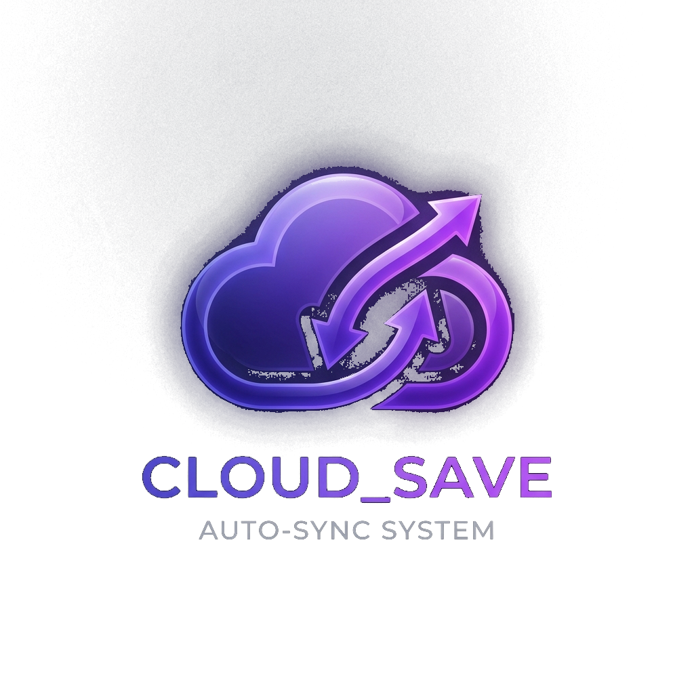
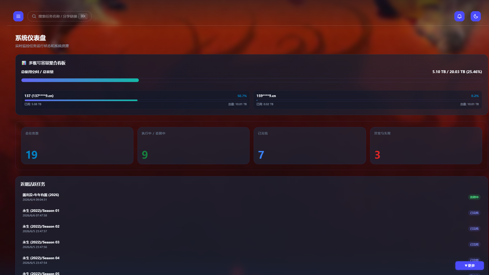
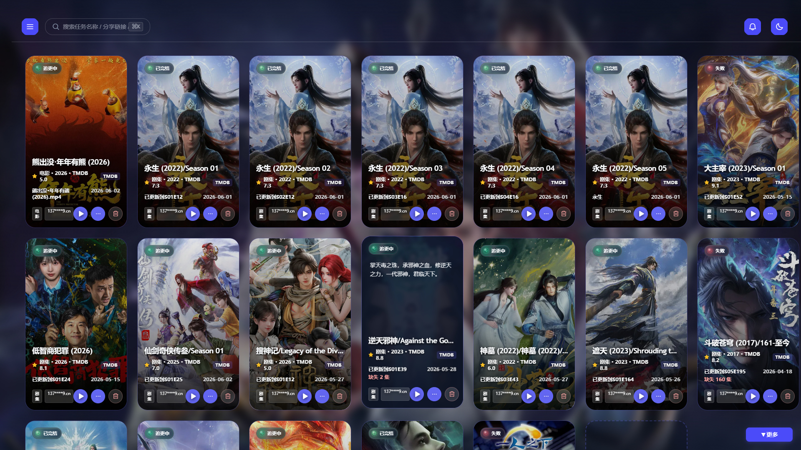
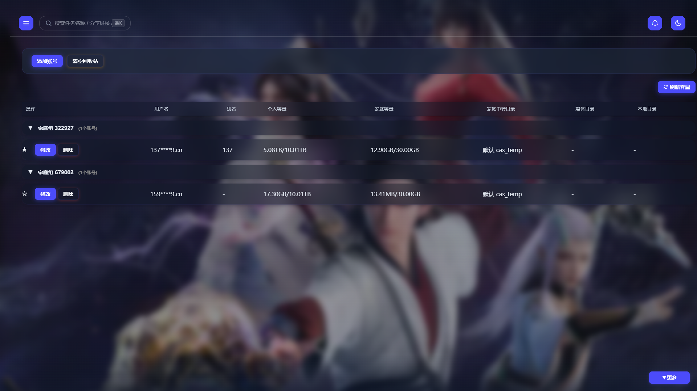
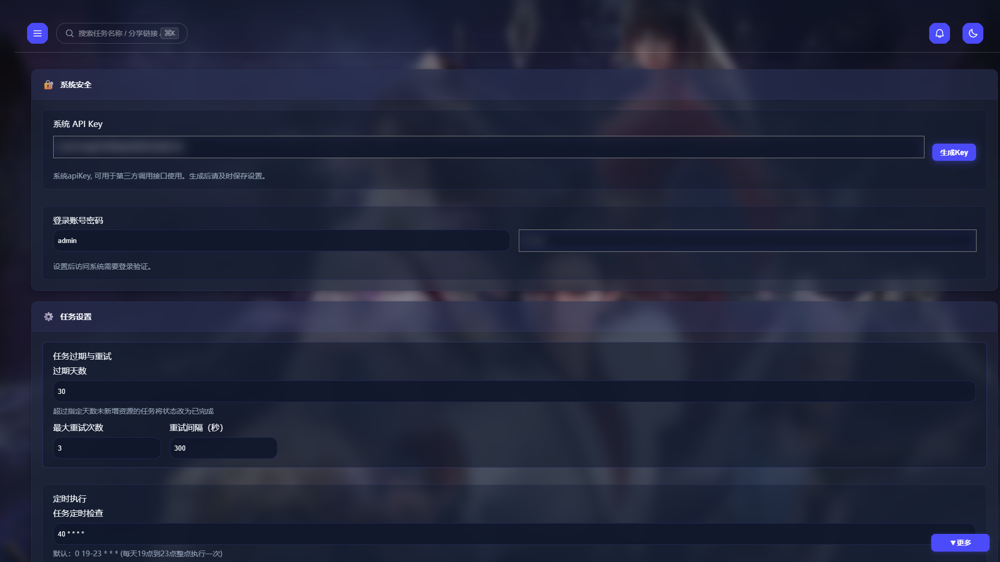
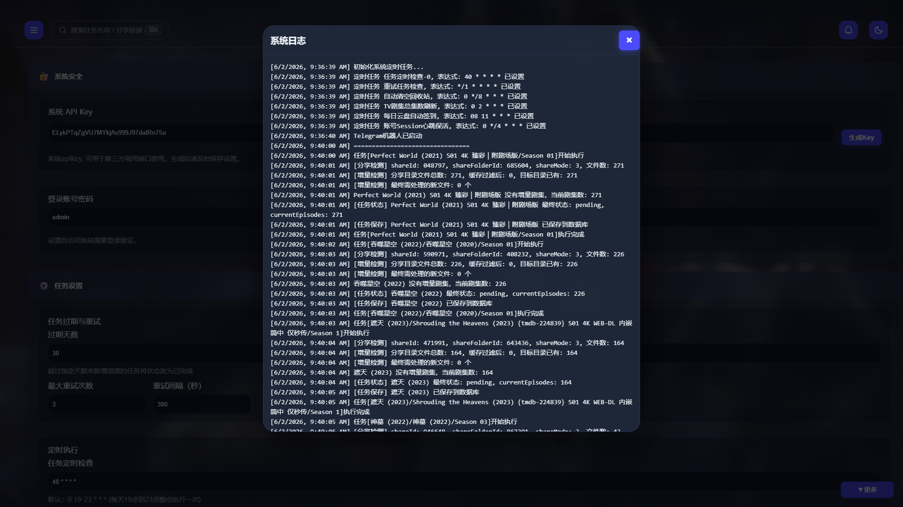
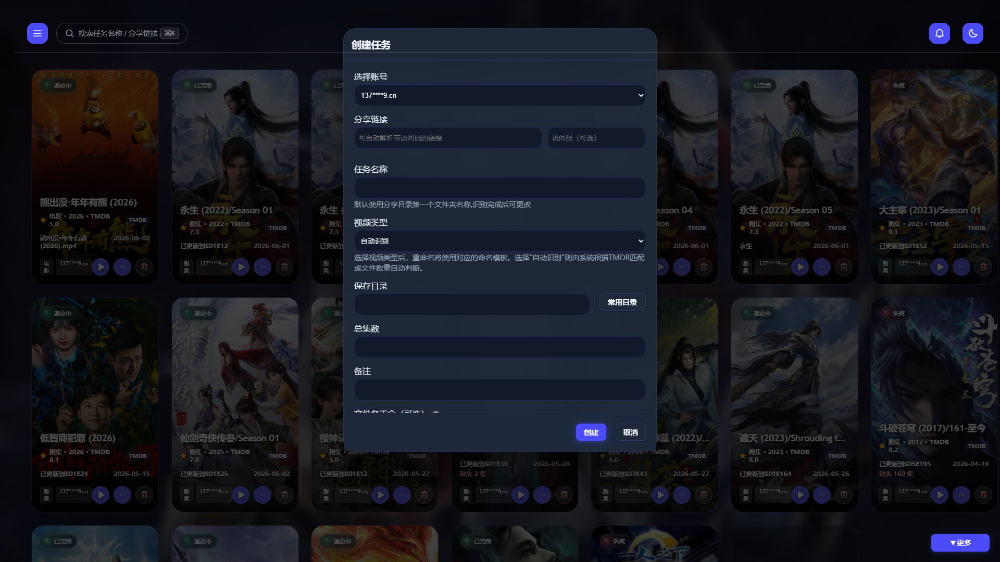

<div align="center">
    
    <h1>cloud189-auto-save</h1>
    <p>天翼云盘自动转存系统二开版：自动追更转存、CAS 家庭中转秒传、AI 重命名、TMDB 级联级联绑定、SmartStrm Webhook、Telegram/企业微信交互与影院模式界面。</p>
    <p>
        <a href="https://github.com/ymting/my-cloud189-auto-save/packages">
            
        </a>
        
        
    </p>
</div>

> [!NOTE]
> 本项目基于 [1307super/cloud189-auto-save](https://github.com/1307super/cloud189-auto-save) 深度二次开发。原版账号配置、基础任务、STRM、Emby 等通用说明可继续参考 [README_orig.md](./README_orig.md)，本文档以当前二开分支（`concept`）源码及最新系统实际情况为准。

## ⚠️ 安全提醒

本系统会保存天翼云盘账号、Cookie、AI Key、TMDB Key、推送 Token 等敏感信息。请私有化部署，不建议直接暴露公网；如需远程访问，请使用 HTTPS、反向代理、强密码和系统 API Key。

---

## 🎨 视觉震撼：Cinema 影院主题界面

本项目引入了全新的现代侧边栏布局与毛玻璃质感组件设计，并深度适配了 **Cinema 影院模式**：
- **海报背景轮播**：支持正在追更的任务海报在背景大图的高斯模糊轮播展示，点击卡片锁定，打造私人影院沉浸感。
- **玻璃质感容量看板**：在前端系统仪表盘集成玻璃质感多账号容量聚合看板，利用内存缓存异步载入，完美避免因为频繁 API 导致界面加载卡顿的问题。
- **系统日志与诊断**：支持后台运行日志的 SSE 实时读取展示，并包含 AI 助手后台运行日志（意图捕获、函数执行、错误定位）的实时监控。

### 系统实际界面截图

| 📊 系统仪表盘 (Dashboard) | 🎬 影视海报墙 (Task) |
|---|---|
|  |  |

| 👥 账号容量管理 (Account) | ⚙️ 系统集成设置 (Settings) |
|---|---|
|  |  |

| 🪵 实时日志弹窗 (Logs) | ➕ 创建任务弹窗 (CreateTask) |
|---|---|
|  |  |

---

## 🌟 concept 分支对比 main 分支（原版）核心新增与优化

本分支（`concept`）作为二次开发增强版，在原版（`main`）基础功能之上进行了大量的核心重构与特性新增，核心对比与优化清单如下：

| 功能模块 | main 分支 (原版) | concept 分支 (二开增强版) |
|---|---|---|
| **🎨 界面设计** | 基础明亮/夜间表格样式 | **Cinema 影院主题模式**：支持海报大图高斯模糊背景轮播、锁定海报、全平台响应式折叠侧边栏、毛玻璃卡片等现代 UI。 |
| **🚀 转存突破** | 普通转存，易受 403 版权管控拦截 | **CAS 家庭空间中转秒传**：读取 `.cas` MD5 指纹秒传至家庭空间，再通过精细签名的 COPY 任务转移至个人目录，完美绕过 403 版权限制。 |
| **🧹 空间容量自愈** | 需前置查询容量，频繁消耗 API 频次 | **响应式容量自愈**：正常秒传无额外 API 交互，遇到 403 空间超限时自动清空 `cas_temp` 中转目录与家庭回收站，并在 1.5s 延迟后自动重试。 |
| **🎬 TMDB 刮削** | 单季手动绑定与刮削 | **连坐级联绑定**：手动绑定某一季 TMDB 后，系统自动寻找相同分享链接下的兄弟季任务**一键同步级联绑定**，并异步触发重命名与扫库。 |
| **🔍 TMDB 搜索算法**| 仅支持基础标题搜索，易超时卡死 | 影视名称年份分离、支持中英文双语搜索与回退、冷门影视 voteCount 阈值微调、Got 10s 超时控制及 3 次指数递增重试防挂死机制。 |
| **👥 多账号与签到** | 需频繁手动刷新，Session 易过期失效 | 每日个人/家庭**自动签到扩容**、聚合多账号容量玻璃看板（异步加载防阻塞）、**4 小时心跳保活与 Token 静默刷新**。 |
| **🤖 AI 智能助手** | 无 AI 对话功能 | **AI 助手 Function Calling 深度集成**：支持在 Web 端通过 AI 聊天直接下发控制指令（如执行、创建、修改任务，清除缓存等）且支持操作安全二次确认。 |
| **🔌 Webhook 触发** | 转存成功即触发，重命名慢时下游刮削出错 | **精细化 Webhook 控制**：调整为“重命名完全完成后”触发，仅处理带 `📁` 路径的重命名消息，完美支持 `{savePath}` 和 `{videoType}` 占位符。 |
| **🪵 系统自愈与性能**| 日志无限制增长，高并发易阻塞死锁 | **日志 5MB 自动滚动截断自愈**（防磁盘爆满）、Express SSE 零阻塞解耦、列表局部静默刷新、取消 5 个活跃任务数限制展示全部任务。 |

---

## 🚀 核心技术特性

### 1. CAS 家庭空间中转秒传与容量自愈
* **突破 403 限制**：对于版权管控的敏感视频资源，通过读取分享目录中的 `.cas` 元数据秒传指纹信息，借助家庭云空间接口进行极速秒传。
* **COPY 签名参数优化**：精确传递 `copyType=2` 以及字符串占位符 `groupId='null'` / `shareId='null'`，完美解决签名计算不一致引发的 401 鉴权问题。
* **响应式自愈清理**：**日常零 API 开销运行**。秒传初始化正常时不进行任何前置容量查询或清理，仅在遇到 403 空间不足错误时触发清理，自动清除 `cas_temp` 中转目录、清空家庭回收站，规避 1.5s 云端对账延迟后自动发起秒传重试（最大重试 3 次，失败自动推送报警），解决配额耗尽问题。

### 2. TMDB 智能识别与同剧多季级联（连坐功能）
* **多季级联同步（连坐功能）**：手动指定/绑定某一季剧集（`tv`）的 TMDB 时，系统会自动寻找相同分享链接下的其他季兄弟任务（相同 `realRootFolderId`），**一键同步级联绑定**，并自动级联触发兄弟任务的自动重命名和 Emby 库扫库，大幅简化重复操作。
* **标题净化与年份分离**：智能剥离任务名中的干扰后缀，将影视年份作为独立参数精确调用 TMDB API 搜索。支持中英文双语搜索与回退。
* **接口稳定性**：got 请求引入 10 秒超时以及最多 3 次递增延迟重试机制，防止请求无限挂起导致前端内存泄露和浏览器无限转圈。

### 3. 多账号保活与每日自动签到
* **每日自动签到**：每日定时自动执行个人签到与家庭签到，自动扩容个人和家庭云空间，并推送签到报告。
* **Session 心跳保活**：每 4 小时执行一次 Session 心跳探测，若失效执行 Token 静默刷新；若彻底失效则发送失效警告提醒用户扫码重新登录。
* **剧集总集数刷新**：每天凌晨 2 点自动刷新未完结剧集的最新总集数，更新集数满足总集数时，任务自动标记为已完结并发送通知。

### 4. SmartStrm Webhook 与消息推送
* **精细化 Webhook 触发**：SmartStrm webhook 调整为在重命名完成或异常兜底时触发（只处理包含 `📁` 路径的消息），防止普通转存完成、AI 会话误触下游生成 STRM。
* **多渠道推送**：支持 Telegram Bot (交互式操作 / AI 对话 / TMDB 绑定 / 长消息分页)、企业微信自建应用回调、Bark、WxPusher 等。
* **去重逻辑**：跨格式匹配，跳过已处理文件，节省 API 开销。

---

## 🛠️ 快速部署与启动

### Docker 部署 (推荐)
GHCR 工作流会按分支生成镜像标签，本二开版本请选择 `concept-latest` 分支镜像：

```bash
docker run -d \
  --name cloud189-auto-save \
  --restart unless-stopped \
  -p 3000:3000 \
  -v /yourpath/data:/home/data \
  -v /yourpath/strm:/home/strm \
  -e PUID=0 \
  -e PGID=0 \
  ghcr.io/ymting/my-cloud189-auto-save:concept-latest
```

* **默认登录凭证**：
  * 用户名：`admin`
  * 密码：`admin`
  *(请在首次登录后于系统设置中立即修改默认密码)*。

### 源码部署
```bash
yarn install
yarn build
yarn start
```
开发模式下可直接使用 `yarn dev` 启动，默认监听 `3000` 端口。

---

## 📂 目录结构说明

```text
src/
├── index.js                     # Express 入口与 API 路由
├── database/index.js            # SQLite + TypeORM 数据源
├── entities/index.ts            # Account / Task / CommonFolder 数据实体
├── utils/
│   └── logUtils.js              # 日志截断控制与 SSE 推送
├── services/
│   ├── task.js                  # 任务执行、CAS秒传、重命名核心逻辑
│   ├── taskEventHandler.js      # 任务事件分发、通知、刮削、Webhook 触发
│   ├── cloud189.js              # 天翼云盘 SDK 封装、会话探测与容量自愈
│   ├── ai.js                    # OpenAI 兼容调用与流缓冲器
│   ├── AIIntentService.js       # AI 操作意图与安全分级
│   ├── tmdb.js                  # TMDB 验证(兼容v3/v4)与刮削
│   ├── strm.js                  # STRM 生成与 Alist 全量挂载映射
│   └── message/
│       └── CustomPushService.js # 消息过滤分发与自定义推送
└── public/
    ├── index.html               # 侧边栏仪表盘 Web UI
    ├── js/                      # 前端操作与 SSE 渲染
    └── css/                     # Cinema 与明亮主题、毛玻璃卡片样式
```

---

## 🔗 主要 API 接口

所有 `/api/*` 接口默认需要登录 Session；也可以在请求头携带 `x-api-key`，值为系统设置中的 API Key。

| 方法 | 路径 | 用途 |
|---|---|---|
| `GET` | `/api/accounts` | 账号列表与个人/家庭容量状态 |
| `POST` | `/api/accounts` | 新增账号（支持账号密码/Cookie/扫码登录） |
| `GET` | `/api/accounts/storage-summary` | 获取多账号容量聚合数据 |
| `POST` | `/api/accounts/refresh-capacity` | 强制刷新容量缓存 |
| `PUT` | `/api/accounts/:id/family-folder` | 设置家庭中转目录 |
| `GET` | `/api/tasks` | 全局过滤与模糊搜索任务列表 |
| `POST` | `/api/tasks` | 创建任务（支持 TMDB 预选绑定） |
| `PUT` | `/api/tasks/:id` | 更新任务信息及修改分享链接 |
| `POST` | `/api/tasks/:id/execute` | 立即手动执行任务 |
| `POST` | `/api/tasks/:id/clear-cache` | 清任务缓存，将追更进度归零 |
| `POST` | `/api/tasks/:id/manual-tmdb` | 手动指定 TMDB 并触发季数连坐级联重命名 |
| `GET` | `/api/tmdb/search` | TMDB 搜索（包含双语回退） |
| `POST` | `/api/chat/enhanced` | AI 智能助手 Function Calling 对话 |
| `POST` | `/api/strm/generate-all` | 基于 Alist 路径全量 STRM 生成 |

---

## 🪵 变更历史

### v3.0.0 (当前版本 - 2026-06二开重构)
* **容量自愈清理**：重构 CAS 秒传流程，实现 403 空间超限时的响应式自愈（清空 `cas_temp` 及家庭回收站）与 1.5s 延迟后自动重试，移除冗余的主动预检测，极大减少 API 请求频次开销。
* **多账号自动签到与心跳保活**：每日凌晨定时签到自动扩容，每 4 小时进行心跳会话检测并在失效时静默刷新。
* **连坐级联绑定**：手动绑定 TMDB 后，相同分享链接的兄弟任务（其他季）自动提取 Season 号同步级联绑定，并异步触发重命名和扫库。
* **智能重命名网络优化**：TMDB 接口接入超时与 Got 自定义 3 次重试，全面支持 v3 (API Key) 与 v4 (Bearer Token) 鉴权校验，彻底解决无限加载与内存泄露。
* **界面体验深度适配**：完成 Cinema 影院模式海报背景轮播、局部渐变毛玻璃卡片设计，修复了弹窗穿透重叠及手机移动端浏览器的全面适配。
* **后台日志自愈截断**：新增日志 5MB 自动滚动截断清理，确保服务器磁盘不爆满，并在 Web 端日志透出 AI 意图流转日志。

---

## 鸣谢

* [原版项目：1307super/cloud189-auto-save](https://github.com/1307super/cloud189-auto-save)
* [OpenList](https://github.com/OpenListTeam/OpenList) - 家庭空间接口与转存参考
* [OpenList-CAS](https://github.com/GitYuA/OpenList-CAS) - CAS 秒传参考
